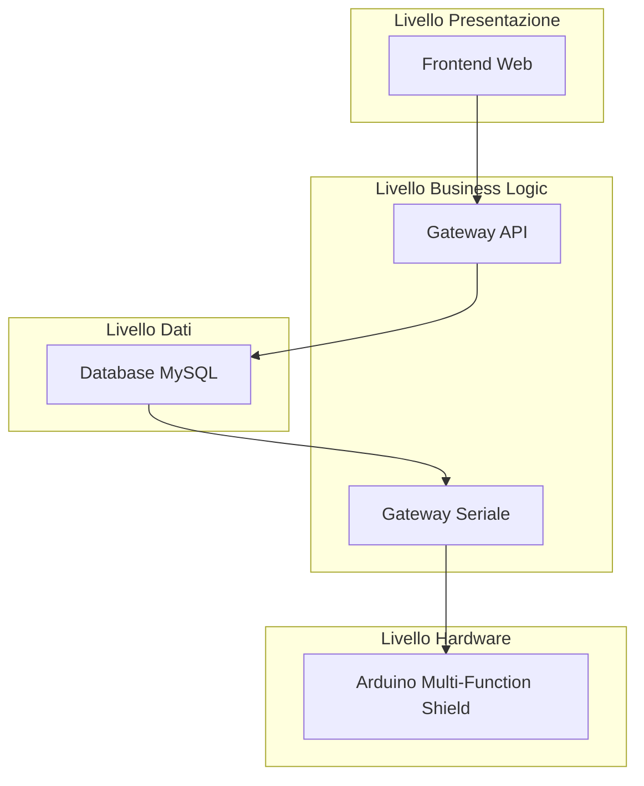

# 🔧 Sistema Gestione Lavorazioni Temporizzate

> **Prova d'Esame Finale - TECNICO SUPERIORE DIGITAL SOLUTIONS 4.0**
> 
> Sistema completo per la gestione temporizzata delle fasi produttive con controllo Arduino e interfaccia web.

[](https://nodejs.org/)
[](https://mysql.com/)
[](https://arduino.cc/)
[](LICENSE)

## 📋 Indice

- [Panoramica](#panoramica)
- [Architettura](#architettura)
- [Requisiti](#requisiti)
- [Installazione](#installazione)
- [Configurazione](#configurazione)
- [Utilizzo](#utilizzo)
- [API Reference](#api-reference)
- [Troubleshooting](#troubleshooting)
- [Contribuire](#contribuire)

## 🎯 Panoramica

Il Sistema Gestione Lavorazioni Temporizzate è una soluzione completa che permette di:

- **Parametrizzare** lavorazioni da interfaccia web
- **Controllare** l'esecuzione tramite Arduino con Multi-Function Shield
- **Monitorare** lo stato in tempo reale
- **Archiviare** lo storico delle operazioni

### ✨ Caratteristiche Principali

- 🔄 **Real-time**: Aggiornamenti stato ogni secondo
- 🎛️ **Hardware Control**: Gestione completa Arduino Multi-Function Shield
- 🌐 **Web Interface**: Interfaccia moderna e responsive
- 📊 **Logging**: Storico completo delle operazioni
- 🔗 **API REST**: Endpoints per integrazione
- 🛡️ **Fault Tolerance**: Gestione automatica disconnessioni

## 🏗️ Architettura



### 🔧 Componenti

| Componente | Tecnologia | Responsabilità |
|------------|------------|----------------|
| **Frontend Web** | HTML5 + CSS3 + JavaScript | Interfaccia utente, form input, visualizzazione |
| **Gateway API** | Node.js + Express | REST API, CRUD operazioni, validazione |
| **Gateway Seriale** | Node.js + SerialPort | Comunicazione Arduino, polling database |
| **Database** | MySQL 8.0+ | Persistenza dati, logging eventi |
| **Arduino** | C++ + Multi-Function Shield | Controllo hardware, display, LED, pulsanti |

## 📋 Requisiti

### Software
- **Node.js** 16.0.0+
- **MySQL** 8.0+
- **Arduino IDE** 1.8.0+ (per programmazione scheda)

### Hardware
- **Arduino Uno/Nano** compatibile
- **Multi-Function Shield** con:
  - Display 7-segmenti a 4 cifre
  - 4 LED (rosso, verde, blu, giallo)
  - 3 pulsanti (S1, S2, S3)
  - Buzzer integrato

### Librerie Arduino
```cpp
#include <TimerOne.h>
#include <Wire.h>
#include <MultiFuncShield.h>
#include <ArduinoJson.h>
```

## 🚀 Installazione

### 1. Clone Repository
```bash
git clone https://github.com/user/sistema-gestione-lavorazioni.git
cd sistema-gestione-lavorazioni
```

### 2. Installazione Dipendenze
```bash
npm install
```

### 3. Setup Database
```bash
# Avvia MySQL e crea database
npm run setup-db
```

### 4. Programmazione Arduino
1. Apri `arduino/lavorazioni-controller.ino` in Arduino IDE
2. Installa librerie richieste:
   - TimerOne
   - MultiFuncShield
   - ArduinoJson
3. Carica sketch su Arduino

## ⚙️ Configurazione

### Database MySQL
```javascript
// database/setup-database.js
const dbConfig = {
    host: 'localhost',
    port: 3306,
    user: 'root',
    password: '', // Inserisci password
    database: 'esame'
};
```

### Porta Seriale Arduino
Il sistema rileva automaticamente Arduino, ma puoi specificare manualmente:
```javascript
// gateway/gateway-serial.js
const ARDUINO_PORT = '/dev/tty.usbmodem21101'; // macOS
// const ARDUINO_PORT = 'COM3'; // Windows
// const ARDUINO_PORT = '/dev/ttyUSB0'; // Linux
```

## 🎮 Utilizzo

### Avvio Sistema Completo
```bash
# Terminal 1 - Gateway API + Frontend
npm start

# Terminal 2 - Gateway Seriale Arduino
npm run gateway-serial
```

### Accesso Interfaccia Web
Apri browser su: `http://localhost:3000`

### Workflow Operativo

1. **Configurazione Lavorazione**
   - Compila form con identificativo, nome, durata
   - Clicca "Crea Lavorazione"

2. **Invio ad Arduino**
   - Seleziona lavorazione da tabella
   - Clicca "Invia ad Arduino"
   - LED 1 si accende (coda)

3. **Gestione Arduino**
   - **Pulsante 1**: Accetta lavorazione → Display nome
   - **Pulsante 2**: Avvia lavorazione → LED 2 + countdown
   - **Pulsante 3**: Rifiuta/Cancella → LED 3 + "CANC"

4. **Completamento**
   - Fine countdown → LED 4 + beep + "END"
   - Log automatico in database

## 🔌 API Reference

### Lavorazioni

#### `POST /api/lavorazioni`
Crea nuova lavorazione
```json
{
  "identificativo": "LAV001",
  "nome": "Lavorazione Test",
  "durata": 30
}
```

#### `GET /api/lavorazioni`
Lista tutte le lavorazioni
```json
{
  "success": true,
  "data": [
    {
      "id": 1,
      "identificativo": "LAV001",
      "nome": "Lavorazione Test",
      "durata": 30,
      "stato": "CONFIGURATA",
      "created_at": "2025-07-21T10:30:00.000Z"
    }
  ]
}
```

#### `POST /api/lavorazioni/:id/invia`
Mette lavorazione in coda per Arduino
```json
{
  "success": true,
  "message": "Lavorazione messa in coda per Arduino"
}
```

### Monitoraggio

#### `GET /api/log`
Storico lavorazioni
```json
{
  "success": true,
  "data": [
    {
      "id": 1,
      "lavorazione_id": 1,
      "stato": "COMPLETATA",
      "orario_evento": "2025-07-21T10:35:00.000Z",
      "note": "Lavorazione completata con successo"
    }
  ]
}
```

#### `GET /api/status`
Stato sistema completo
```json
{
  "success": true,
  "sistema": {
    "database_connesso": true,
    "arduino_connesso": true,
    "arduino_porta": "/dev/tty.usbmodem21101"
  },
  "statistiche": {
    "stati_lavorazioni": [
      {"stato": "CONFIGURATA", "count": 3},
      {"stato": "COMPLETATA", "count": 5}
    ]
  }
}
```

## 🔍 Troubleshooting

### Arduino non rilevato
```bash
# Controlla porte disponibili
ls /dev/tty.usb*     # macOS
ls /dev/ttyUSB*      # Linux
# Windows: Device Manager → Porte COM
```

### Errori Database
```bash
# Verifica servizio MySQL
sudo systemctl status mysql    # Linux
brew services list | grep mysql # macOS

# Reset database
npm run setup-db
```

### Performance Issues
```bash
# Monitor logs gateway seriale
npm run gateway-serial

# Controlla polling stats nel log ogni 100 iterazioni
```

### Debugging Frontend
1. Apri Developer Tools (F12)
2. Controlla Console per errori JavaScript
3. Verifica Network tab per chiamate API fallite

## 🏆 Testing

### Test Funzionali
```bash
# Test API
npm test

# Test manuale workflow completo
1. Crea lavorazione "TEST01" 10 secondi
2. Invia ad Arduino
3. Accetta con pulsante 1
4. Avvia con pulsante 2
5. Attendi completamento
6. Verifica log in database
```

### Validazione Hardware
- Tutti i LED devono rispondere correttamente
- Display deve mostrare countdown
- Buzzer deve suonare al completamento
- Pulsanti devono essere responsivi

## 📊 Monitoring

### Metriche Sistema
- **Polling Rate**: 1 secondo
- **Response Time API**: < 100ms
- **Arduino Communication**: < 500ms
- **Database Queries**: < 50ms

### Log Files
- **Gateway API**: Console output
- **Gateway Seriale**: Console + polling stats
- **Arduino**: Serial monitor (9600 baud)

## 🔒 Sicurezza

### Input Validation
- Lunghezza identificativo: max 50 caratteri
- Durata lavorazione: > 0 secondi
- Sanitizzazione input SQL injection

### Best Practices
- Prepared statements per database
- CORS configurato correttamente
- Error handling senza data exposure

## 🚦 Stati Sistema

### Stati Lavorazione Database
- `CONFIGURATA` → Creata da frontend
- `IN_CODA` → In attesa invio Arduino
- `INVIATA` → Inviata ad Arduino

### Stati Arduino Interni
- `WAITING_LAVORAZIONE` → In attesa
- `LAVORAZIONE_IN_CODA` → LED 1 ON
- `LAVORAZIONE_ACCETTATA` → Display nome
- `COUNTDOWN_ATTIVO` → LED 2 ON + countdown
- `LAVORAZIONE_COMPLETATA` → LED 4 ON + beep
- `LAVORAZIONE_RIFIUTATA` → LED 3 ON + "CANC"

### Eventi Log Tracciati
- `INVIATA` → Gateway → Arduino
- `ACCETTATA` → Pulsante 1 Arduino
- `AVVIATA` → Pulsante 2 Arduino
- `COMPLETATA` → Fine countdown
- `RIFIUTATA` → Pulsante 3 (prima accettazione)
- `CANCELLATA` → Pulsante 3 (durante countdown)

## 📝 Changelog

### v1.0.0 - Release Finale Esame
- ✅ Implementazione completa tutti i 5 compiti
- ✅ Arduino Multi-Function Shield supportato
- ✅ Gateway doppio (API + Seriale)
- ✅ Database MySQL con logging completo
- ✅ Frontend web responsivo
- ✅ Auto-discovery Arduino
- ✅ Real-time monitoring
- ✅ Error handling robusto

## 👥 Autore

**Studente ITS Academy**
- Corso: TECNICO SUPERIORE DIGITAL SOLUTIONS 4.0
- Esame: Sistema Gestione Lavorazioni Temporizzate
- Data: 21 luglio 2025

## 📄 License

MIT License - vedere file LICENSE per dettagli

## 🔗 Link Utili

- [Arduino Multi-Function Shield Guide](https://www.instructables.com/Multi-Function-Shield/)
- [Node.js SerialPort Documentation](https://serialport.io/docs/)
- [MySQL 8.0 Documentation](https://dev.mysql.com/doc/)
- [Express.js Guide](https://expressjs.com/)